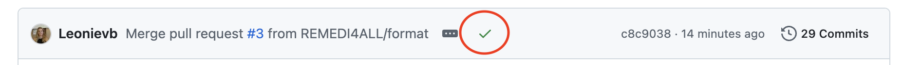
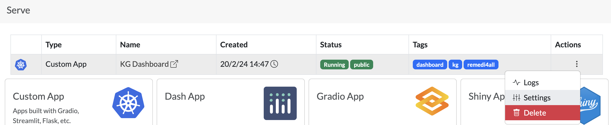

# Expertise KG Dashboard

This is a repository for building the REMEDi4ALL expertise KG dashboard and deploying the dashboard on SERVE platform.

# Missing Data? Incorrect information?

The form represents data collected from the survey form ([here](https://forms.office.com/e/31VQV0E9bp)). If the information is incorrect or incomplete, reach out to Philip Gribbon (Fraunhofer ITMP).

# Preparing files for updating the dashboard

The dashboard is linked to the Expertise KG and pulls data from there. Thus, when the KG is updated, make sure you update the respective files in this repo as well, but simply re-running the [python script](queries.py). 

If you have a new data modality added, please make sure you have a CYPHER query to fetch that data or metadata from the KG. All CYPHER queries can be found [here](queries.py). With the CYPHER queries, you can create the files in the [data](data) directory.

To run the file, edit the credentials at the bottom of the [python file](queries.py):
```python
graph = connect_to_kg(url="URL_HERE", username="USERNAME_HERE", password="PASSWORD_HERE")  #
```
> **The credentials can be found [here](https://github.com/REMEDI4ALL/expertise-kg/blob/main/src/constants.py#L12). Please ensure you do not make them public, as the graph is GDPR-compliant and project-restricted only.**

and then run the file in the terminal using the following command:
```bash
python run queries.py
```
> **_NOTE:_** If a new data modality is added, please ensure that you add and adapt this in the `run_all_queries()` function in the python file mentioned above.

# Local testing

Prior to pushing the final commits live, ensure that the webpage looks as expected. You can do so using the following command in the terminal:
```bash
streamlit run dashboard.py
```

Ensure that (a) you are in the appropriate conda environment and (b) you are in the `r4a_kg_dashboard` directory.

# Deploying Live

### Using PRs
Once you have tested your local changes, open a pull request (PR). As a good practice, it is good to have your PR reviewed by co-workers to ensure code readability (if possible). 

### Docker deployment
Upon reviewing, merge the PR into the main branch. Each commit to the main branch calls a GitHub workflow that allows for building a Docker image of the current instance or updates the old image to the new one. The list of all previous images can be found [here](https://github.com/REMEDI4ALL/kg_dashboard/pkgs/container/kg_dashboard%2Fkg_dashboard). 

A green tick (see below) in front of the commit confirms that the Docker image was built without errors. If you see a red cross, please check the run log for you commit [here](https://github.com/REMEDI4ALL/kg_dashboard/actions) and debug the error. Assistance from the SERVE team can also be asked if needed.


### Updating the SERVE instance

To update the live instance, open the project on SERVE ([link](https://serve.scilifelab.se/projects/expertise-kg-dashboard-mxc/))^. In the **Serve** section of the project, go to Action -> Settings (see figure below).



In the settings, scroll down to the **Image** section and replace this with the latest version from the [packages](https://github.com/REMEDI4ALL/kg_dashboard/pkgs/container/kg_dashboard%2Fkg_dashboard). The latest version is always on the top. Make sure, it starts with *ghcr.io/xxx*.

*^ You need an active [SERVE account](https://serve.scilifelab.se/) and access to the project.*

Once you have saved the changes, wait for the **Status** of the project to change from *Running* to *Created* and back to *Running*. Once you see the *Running* option, the updated version is now life.

If you see an *Error* status, reach out to the SERVE team over Slack for assistance.

# Developers and Contributors

* Yojana Gadiya, Fraunhofer ITMP (Lead)
* Leonie Von Berlin, Fraunhofer ITMP (Co-Lead)

### Data providers

* WP 4-6 (Technical expertise)
* WP 7 (Clinical services)
* Michaela Vallin, Karloinka Institute; Annika Jenmalm Jensen, Karloinka Institute; and Katja Herzog, Fraunhofer ITMP (SOP/SOG)
